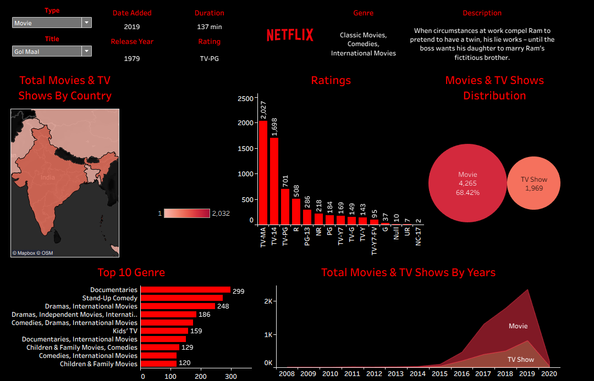

# 📊 Netflix Dashboard (Tableau)

This project is a **Tableau dashboard** created to analyze and visualize Netflix’s Movies & TV Shows dataset.  
It highlights global trends in content distribution, genres, ratings, and yearly additions to the platform.  

---

## 🚀 Features
- **Total Movies & TV Shows by Country**  
  World map showing content availability across countries.

- **Ratings Distribution**  
  Bar chart showing distribution of Movies & TV Shows by ratings (TV-MA, TV-14, PG, etc.).

- **Movies vs TV Shows**  
  Bubble chart showing proportion of Movies vs TV Shows.

- **Top 10 Genres**  
  Bar chart ranking the most popular genres (Documentaries, Stand-up Comedy, Dramas, etc.).

- **Trend Over Years**  
  Area chart showing total Movies & TV Shows added each year (2008–2020).

- **Interactive Filters**  
  - Filter by Title, Release Year, Type (Movie/TV Show), and Rating.  
  - Displays details such as runtime, description, and genre for selected titles.

---

## 🛠️ Tools Used
- **Tableau** – Data Visualization
- **Dataset** – Netflix Movies and TV Shows (Kaggle or similar sources)

---

## 📂 Project Files
- `Netflix Dashboard.twb` → Tableau workbook file  
- `netflix_dashboard.png` → Screenshot of the dashboard  

---

## 📸 Dashboard Preview

---

## 📈 Insights
- Majority of Netflix content is **Movies (68.42%)** compared to TV Shows.  
- **TV-MA** and **TV-14** are the most common content ratings.  
- **Documentaries** and **Stand-Up Comedy** are the top genres.  
- Content additions peaked around **2018–2019**, followed by a sharp decline in 2020.  
- The **USA and India** dominate in terms of Netflix content availability.  

---

## 📌 How to Use
1. Download the `.twb` file.  
2. Open in **Tableau Desktop**.  
3. Connect with the Netflix dataset (if required).  
4. Explore interactive filters and visualizations.  

---

## 🤝 Contributing
Feel free to fork this repo, raise issues, or submit pull requests if you’d like to improve the dashboard or add new features.  

